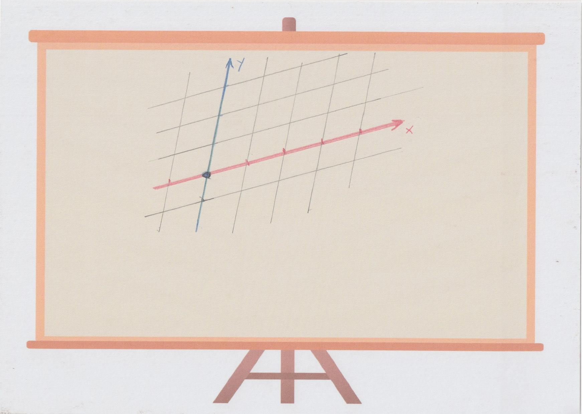
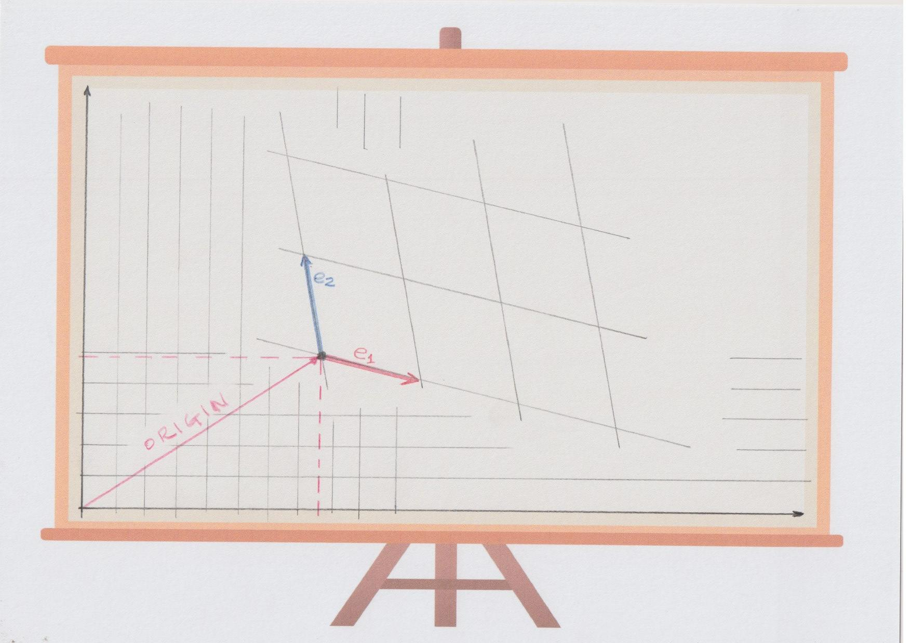

# André's proposal

I imagine two kinds of `Transform2D` users:
1. Regular users.
Users that just want to place and manipulate an object in some (parent) coordinate system.
2. Megazord matrix lovers power users.
People that want to rotate things inside things that rotate and move around.

This proposal aims to be easy and intuitive for regular users,
and yet, powerful and full functional for megazord users.

Although *regular users* usually manipulate `Node2D` and not `Transform2D` directly,
this proposal aims to keep methods of `Node2D` consistent with those of `Transform2D`.


## What `Transform2D` is

Things in Godot are positioned according to coordinates.
We can imagine that the whole *world* has a **global** system of coordinates.
However, in general, we do not use global coordinates.
It is a good practice to develop things *locally*,
*encapsulated* in their own *context*.
In particular, each thing to be positioned somewhere should have its own set of *local coordinates*.




In Godot, things are sort of *chained*. For example, some `Node A` can be put in the world, and some other `Node B` is put inside this first node. Each node has an instance of `Transform2D` that describes how its local coordinates can be converted to its parent's coordinate system. To **place a node** in its parent's coordinate system corresponds to properly setting its `Transform2D` instance.

Although we might think of *node* positioning, the `Transform2D` is not aware of the concept of *nodes*. What `Transform2D` does is to convert some pair of numbers (coordinates) into some other pair of numbers. We interpret this as if there is a (local) *coordinate system* inside some other (parent) *coordinate system*.



When we instantiate a `Transform2D` object, we assume there is some *parent coordinate system*.

Therefore, an instance of `Transform2D` is, from the public interface point of view, as a set of three variables. We will give them name in this document, but this does not mean that `Transform2D` needs to be implemented internally using those names.
1. The `origin` (Vector2 origin - $\vec{O}$).
This is where the coordinate $(0,0)$ is mapped to in the *parent coordinate system*.
From the *regular user*'s point of view, it is `position`.
From the *megazord user*'s point of view, it is `origin`.
2. The `x-axis` (Vector2 e1 - $\vec{e_1}$).
Departing from `origin`, this represents one unit in the $x$ direction in the *parent coordinate system*.
3. The `y-axis` (Vector2 e2 - $\vec{e_2}$).
Departing from `origin`, this represents one unit in the $y$ direction in the *parent coordinate system*.

All vectors above are given in the *parent coordinate system*.

A *local coordinate* $(a,b)$, shall yeld
\begin{equation\*}
  (\text{new $a$}, \text{new $b$})
  =
  \vec{O} + a \vec{e_1} + b \vec{e_2}
\end{equation\*}
when converted to the *parent coordinate system*.

For those who like matrices, let us agree that vectors will generally be given as *column* matrices. In this case, `Transform2D` is represented by an <a href="https://en.wikipedia.org/wiki/Affine_transformation#Augmented_matrix">augmented matrix</a>. Local to parent coordinate conversion corresponds to
\begin{equation\*}
  \begin{bmatrix}
    \text{new $a$} \\ \\ \text{new $b$} \\ \\ 1
  \end{bmatrix}
  =
  \begin{bmatrix}
    e1.x & e2.x & origin.x \\ \\
    e1.y & e2.y & origin.y \\ \\
    origin.x & origin.y & 1
  \end{bmatrix}
  \begin{bmatrix}
    a \\ \\ b \\ \\ 1
  \end{bmatrix}.
\end{equation\*}


# Public methods

**Attention:**
This does not tell how each method shall be implemented internally.
The idea is to simply describe the method behaviour...
but some times it is easier to use code instead of words.


## Position

Those methods place the local coordinate system inside another (parent) coordinate system.

```
  const Vector2 Transform2D::get_origin()
  {
    return origin;
  }
```


```
  void Transform2D::set_origin(const Vector2 &position)
  {
    origin = position;
  }
```

```
  void Transform2D::translate(const Vector2 &translation)
  {
    origin += translation;
  }
```

It is like if the *parent* is moving the *child* coordinate system around.
If you throw a stone,
you **don't do it** in the stone's internal coordinate system!
You do it in the coordinate system where the stone is placed.
That is,
you do it in the **parent coordinate system**.
For that reason,
`translation` is given in the *parent coordinate system*.
Not in *local coordinates*.


```
  void Transform2D::translate_local(const Vector2 &translation)
  {
    origin += translation.x * e1 + translation.y * e2;
  }
```

This is like if the object is moving **itself**, relative to its own units / size.
Like a spaceship moving forward.
If you double its size, the speed will be doubled as well.


### Compatibility issue

In current implementation, our `translate` does not exist.
There is no method for **moving things** around.
Current's implementation `translate` is what we call `translate_local`.


## Scaling

The current scaling implementation is, IMO, a little messy.

I really think there is not much use for uneven scaling (different scale for $x$ and $y$).
Uneven scaling can be achieved by directly manipulating $\vec{e_1}$ and $\vec{e_2}$.

Here is an ideal world.
But it is important to notice that the real world is not ideal,
and `Node2D` makes use of the uneven version of *scaling*
(although not through the methods described here).
Therefore,
I shall write a second proposal that specifies uneven scaling if there is a demand.


```
  real_t get_scale() const
  {
    return e1.length();
  }
```

This function makes the assumption that there is a uniform scale.
That is, it assumes that `e1.length() == e2.length()`.
It makes no sense to call `get_scale()` if the scaling is uneven.


```
  void set_scale(real_t s)
  {
    e1.normalize();
    e2.normalize();
    scale(s);
  }
```

Sets the size of the vectors $\vec{e_1}$ and $\vec{e_2}$.
The *position* (*origin*) does not change:
the object will be scaled *in place*.


```
  void scale(real_t s)
  {
    e1*= scale;
    e2*= scale;
  }
```

Multiplies the size of the vectors $\vec{e_1}$ and $\vec{e_2}$ by $s$.
The *position* (*origin*) does not change:
the object will be scaled *in place*.


### Compatibility issue


Current implementation is messy.

Size2


### What scaling is NOT


## Rotating

## Flipping

This method is not really needed.
Its specification was motivated by the fact that with *uneven scaling* on can actually call
`scale(Vector2(1,-1))`.
Since we are not allowing uneven scaling in this specification,
the *flipping* operations can be useful.

```
  void flip_axis(Vector2 axis)
  {
    real_t len2 = axis.x * axis.x + axis.y * axis.y;
    real_t p = (axis.y * axis.y - axis.x * axis.x) / len2;
    real_t q = -2 * axis.x * axis.y / len2;
    e1 = Vector2(p * e1.x + q * e1.y, q * e1.x - p * e1.y);
    e2 = Vector2(p * e2.x + q * e2.y, q * e2.x - p * e2.y);
  }
```

Flips (mirror) the coordinate system about the given `axis` through the `origin`.
The `origin` is kept fixed.

In matrix notation,
assuming `axis` is normalized and equal to $(a_1, a_2)$,
$\vec{e_1}$ and $\vec{e_2}$ shall be processed by the matrix
\begin{equation\*}
  \begin{bmatrix}
    p & q \\ \\
    q & -p
  \end{bmatrix}
  =
  \begin{bmatrix}
    a_2^2 - a_1^2 & -2 a_1 a_2 \\ \\
    -2 a_1 a_2 & a_1^2 - a_2^2
  \end{bmatrix}
  =
  \begin{bmatrix}
    a_1 & -a_2 \\ \\
    a_2 & a_1
  \end{bmatrix}
  \begin{bmatrix}
    1 & 0 \\ \\
    0 & -1
  \end{bmatrix}
  \begin{bmatrix}
    a_1 & a_2 \\ \\
    -a_2 & a_1
  \end{bmatrix}.
\end{equation\*}
This can be made more efficient if we do not normalize `axis`,
and instead divide the result by $a_1^2 + a_2^2$.


```
  void flip_direction(Vector2 direction)
  {
    flip_axis(Vector2(direction.y, -direction.x));
  }
```

Flips (mirror) the image toward the given `direction` through the `origin`.
The `origin` is kept fixed.

One possible implementation is to simply rotate `direction` 90 degrees to get the rotation axis.
And then, call `flip_axis()`.


```
  bool is_flipped()
  {
    return (e1.x * e2.y - e1.y * e2.x < 0);
  }
```

Returns true is the image is *flipped* (mirrored).


## Setting skew

## Set axis


# Discussion

## Scaling about what point?

In its simplest form,
*scaling* is just making the thing bigger or smaller.
But there is one catch:
> When you *scale* something,
> you do it about a certain point, that is kept fixed.

With all due respect,
the current implementation is quite messy about this.
The method used by `Node2D` (`set_rotation_scale_and_skew()`)
assumes that scaling is always done keeping the `origin` fixed.
Exactly as we propose `scale` and `set_scale` should behave.

However,
in current implementation,
`scale` and `set_scale` assume that the `origin` shall also move with *scaling*.
That is,
scaling is done about the parent's `origin`.
This is **not consistent** with `Node2D` behaviour.
Of course,
it would make more sense if `Translate2D::set_scale()`
was consistent with `Node2D::set_scale()`.

Also,
by the way, there is no `Node2D::scale()`.
But there is a `Node2D::apply_scale()`.
Again,
it would make sense to make `Transform2D::scale()`
consistent with `Node2D::apply_scale()`.

I would say that the need to scaling about the *parent*'s origin
is an indication of *bad design*.
I see two use cases:

1. **Scenario 1:** There is a node `A` with many child nodes.
The programmer wants to rescale the whole contents of node `A` by rescaling every child.
The **correct** approach here would be to rescale `A`, and not its children.
2. **Scenario 2:** There is a node `A` and a group of its child nodes.
The programmer wants to rescale only those child nodes in this group, not the other child nodes.
The **correct** approach here would be to create a node `G`, put this special group of child nodes of `A` inside `G`, instead. And then, and place `G` in `A`. Now, instead of rescaling every child node and their `origin`, one should simply rescale `G`.


## Uneven scaling :-(

In current implementation, scaling is a little more complicated then here,
because it allows one to apply a different scale to the $x$ and $y$ directions.
Let's say $s_x$ in the direction $x$ and $s_y$ in the direction $y$.
Again,
there is a catch:
> When we say $x$ direction...
> are we referring to the *local* $x$ direction,
> or to the *parent* $x$ direction?

To scale relative to the local coordinate system, all we have to do is
\begin{align\*}
  \vec{e_1} *= s_x \\ \\
  \vec{e_2} *= s_y.
\end{align\*}
To scale relative to the parent coordinate system, we need to scale the $x$ coordinate of $\vec{e_1}$ and $\vec{e_2}$, and also the $y$ coordinate of both. For those who like matrices, all we need to do is apply $\begin{bmatrix}s_x & 0 \\ \\ 0 & s_y\end{bmatrix}$ to both:
\begin{align\*}
  \begin{bmatrix}
    \text{new $e1.x$} \\ \\
    \text{new $e1.y$}
  \end{bmatrix}
  &=
  \begin{bmatrix}
    s_x & 0 \\ \\
    0 & s_y
  \end{bmatrix}
  \begin{bmatrix}
    e1.x \\ \\
    e1.y
  \end{bmatrix} \\ \\
  \begin{bmatrix}
    \text{new $e2.x$} \\ \\
    \text{new $e2.y$}
  \end{bmatrix}
  &=
  \begin{bmatrix}
    s_x & 0 \\ \\
    0 & s_y
  \end{bmatrix}
  \begin{bmatrix}
    e2.x \\ \\
    e2.y
  \end{bmatrix}.
\end{align\*}
But `Vector2` also has a method that can be used:
```
  e1 *= Vector2(sx, sy);
  e2 *= Vector2(sx, sy);
```


With all due respect,
current implementation is certainly messy about it.
Some methods assume...
There are methods called `set_rotation_and_scale` and `set_rotation_scale_and_skew`.
Those two methods scale about the `origin`, keeping it fixed.

The implementation of...

